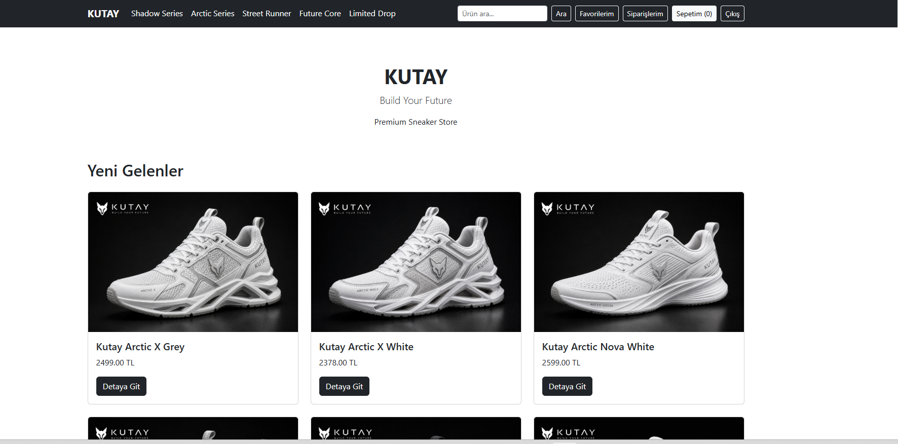
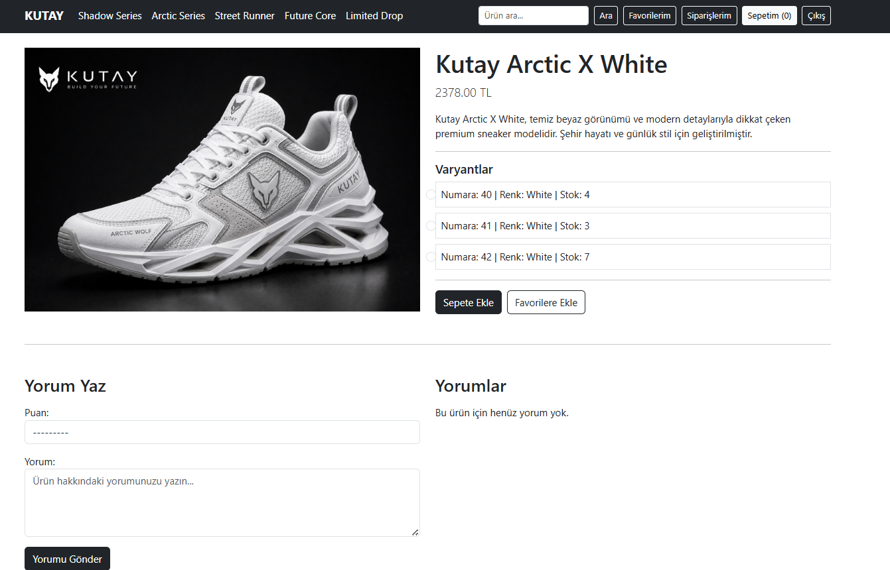
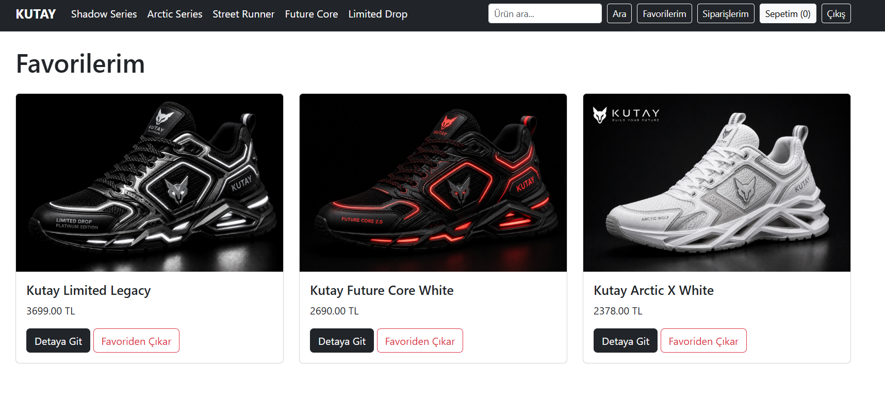
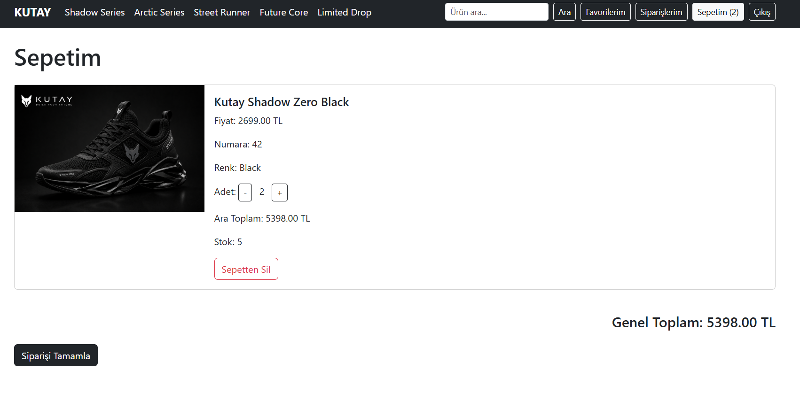
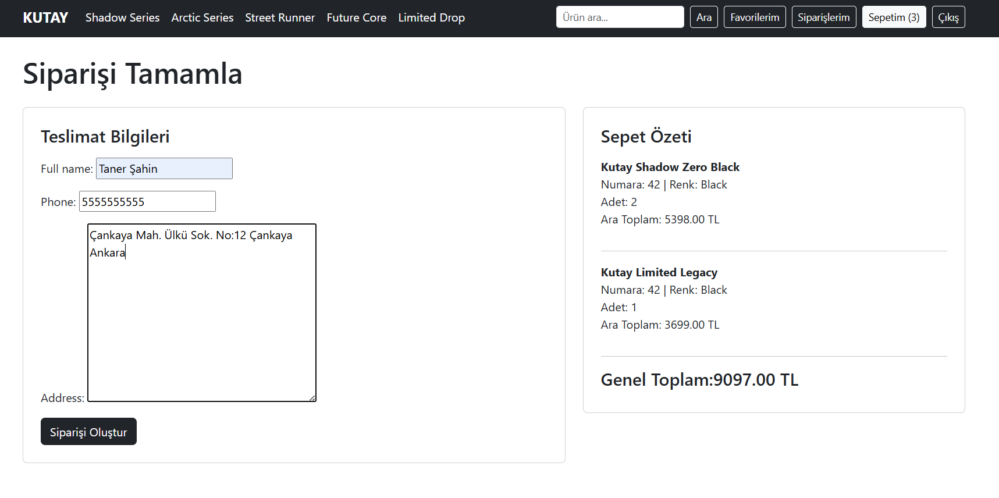
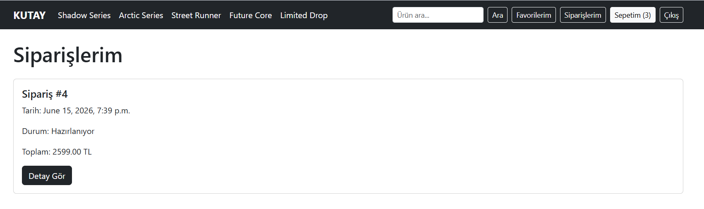
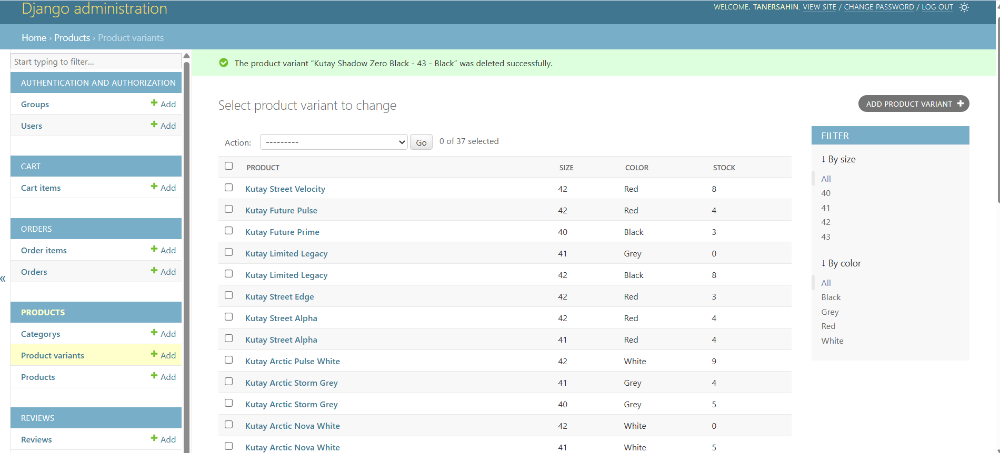

# 👟 SaveBasket

Premium Sneaker E-Commerce Platform built with Django.

Backend-focused Django e-commerce project featuring authentication, category management, product variants, wishlist functionality, stock control, review workflows, cart management, order processing systems, and responsive design.

---

## 📸 Screenshots

### Home Page



### Product Detail



### Wishlist



### Cart



### Checkout



### Orders



### Admin Panel



---

## 🚀 Technologies

### Backend

* Python
* Django

### Database

* SQLite (Development)
* PostgreSQL (Production)

### Frontend

* HTML5
* CSS3
* Bootstrap 5

### Version Control

* Git
* GitHub

### Production & Deployment

* Linux
* Ubuntu Server
* Nginx
* Gunicorn
* PostgreSQL
* SSL Certificate
* Domain Configuration
* Environment Variables

---

## ⚙️ Features

### Authentication System

* User Registration
* User Login
* User Logout
* Protected Pages

### Category Management

* Dynamic Categories
* Category Detail Pages
* Category Navigation

### Product Management

* Product Listings
* Product Detail Pages
* Product Images
* Product Descriptions
* Product Pricing

### Product Variants

* Size Variants
* Color Variants
* Variant-Based Stock Control

### Search & Filtering

* Product Search
* Price Filtering
* Stock Filtering
* Product Sorting

### Wishlist System

* Add To Wishlist
* Wishlist Page
* User-Based Wishlist Management

### Cart System

* Add To Cart
* Remove From Cart
* Increase Quantity
* Decrease Quantity
* Cart Total Calculation
* Stock Limit Control

### Order System

* Checkout Process
* Order Creation
* Order History
* Order Detail Page
* Order Snapshot Logic

### Review System

* Add Review
* Edit Review
* Delete Review
* Rating System
* One Review Per User Rule

### Responsive Design

* Mobile Compatible
* Tablet Compatible
* Desktop Compatible

### Admin Panel

* Product Management
* Category Management
* Variant Management
* Order Management
* User Management
* Review Management

---

## 👟 Categories

* Shadow Series
* Arctic Series
* Street Runner
* Future Core
* Limited Drop

---

## 🛠️ Installation

Clone the repository:

```bash
git clone https://github.com/taner-sahin/SaveBasket.git
```

Navigate to the project directory:

```bash
cd SaveBasket
```

Create virtual environment:

```bash
python -m venv venv
```

Activate virtual environment:

Windows:

```bash
venv\Scripts\activate
```

Linux / macOS:

```bash
source venv/bin/activate
```

Install requirements:

```bash
pip install -r requirements.txt
```

Run migrations:

```bash
python manage.py migrate
```

Create superuser:

```bash
python manage.py createsuperuser
```

Start development server:

```bash
python manage.py runserver
```

Open:

```text
http://127.0.0.1:8000/
```

---

## 📚 What I Learned

* Django Models
* Django Views
* URL Routing
* Template System
* Context Processors
* QuerySets
* Authentication Workflows
* Foreign Keys
* One-to-Many Relationships
* Product Variant Architecture
* Wishlist Logic
* Cart Logic
* Order Workflows
* Review Systems
* Stock Management
* Responsive Design
* Git Workflow
* GitHub Workflow
* Linux Deployment Fundamentals
* Production Deployment Preparation

---

## 📌 Project Status

### Production Ready

### Finished Modules

* Authentication System
* Category System
* Product System
* Product Variant System
* Search System
* Filtering System
* Wishlist System
* Cart System V2
* Stock Control System
* Checkout System
* Order System
* Review CRUD System
* Responsive Layout

---

## 🎯 Goal

Build a production-ready sneaker e-commerce platform while learning professional Django backend development, Linux server management, PostgreSQL database administration, Nginx configuration, Gunicorn deployment, and real-world production workflows.

---

## 👨‍💻 Author

Taner Şahin

GitHub:
https://github.com/taner-sahin

Backend-focused Django Developer building production-ready web applications with Django, PostgreSQL, Linux, Nginx, and Gunicorn.

Currently focused on developing real-world e-commerce systems, deployment workflows, backend architecture, and scalable web applications.
# 👟 SaveBasket

Premium Sneaker E-Commerce Platform built with Django.

Backend-focused Django e-commerce project featuring authentication, category management, product variants, wishlist functionality, stock control, review workflows, cart management, order processing systems, and responsive design.

---

## 📸 Screenshots

### Home Page


### Product Detail


### Wishlist


### Cart


### Checkout


### Orders


### Admin Panel


---

## 🚀 Technologies

### Backend

* Python
* Django

### Database

* SQLite (Development)
* PostgreSQL (Production)

### Frontend

* HTML5
* CSS3
* Bootstrap 5

### Version Control

* Git
* GitHub

### Production & Deployment

* Linux
* Ubuntu Server
* Nginx
* Gunicorn
* PostgreSQL
* SSL Certificate
* Domain Configuration
* Environment Variables

---

## ⚙️ Features

### Authentication System

* User Registration
* User Login
* User Logout
* Protected Pages

### Category Management

* Dynamic Categories
* Category Detail Pages
* Category Navigation

### Product Management

* Product Listings
* Product Detail Pages
* Product Images
* Product Descriptions
* Product Pricing

### Product Variants

* Size Variants
* Color Variants
* Variant-Based Stock Control

### Search & Filtering

* Product Search
* Price Filtering
* Stock Filtering
* Product Sorting

### Wishlist System

* Add To Wishlist
* Wishlist Page
* User-Based Wishlist Management

### Cart System

* Add To Cart
* Remove From Cart
* Increase Quantity
* Decrease Quantity
* Cart Total Calculation
* Stock Limit Control

### Order System

* Checkout Process
* Order Creation
* Order History
* Order Detail Page
* Order Snapshot Logic

### Review System

* Add Review
* Edit Review
* Delete Review
* Rating System
* One Review Per User Rule

### Responsive Design

* Mobile Compatible
* Tablet Compatible
* Desktop Compatible

### Admin Panel

* Product Management
* Category Management
* Variant Management
* Order Management
* User Management
* Review Management

---

## 👟 Categories

* Shadow Series
* Arctic Series
* Street Runner
* Future Core
* Limited Drop


## 📚 What I Learned

* Django Models
* Django Views
* URL Routing
* Template System
* Context Processors
* QuerySets
* Authentication Workflows
* Foreign Keys
* One-to-Many Relationships
* Product Variant Architecture
* Wishlist Logic
* Cart Logic
* Order Workflows
* Review Systems
* Stock Management
* Responsive Design
* Git Workflow
* GitHub Workflow
* Linux Deployment Fundamentals
* Production Deployment Preparation

---

## 📌 Project Status

### Production Ready

### Finished Modules

* Authentication System
* Category System
* Product System
* Product Variant System
* Search System
* Filtering System
* Wishlist System
* Cart System V2
* Stock Control System
* Checkout System
* Order System
* Review CRUD System
* Responsive Layout

---

## 🎯 Goal

Build a production-ready sneaker e-commerce platform while learning professional Django backend development, Linux server management, PostgreSQL database administration, Nginx configuration, Gunicorn deployment, and real-world production workflows.

---

## 👨‍💻 Author

Taner Şahin

GitHub:
https://github.com/taner-sahin

Backend-focused Django Developer building production-ready web applications with Django, PostgreSQL, Linux, Nginx, and Gunicorn.

Currently focused on developing real-world e-commerce systems, deployment workflows, backend architecture, and scalable web applications.
